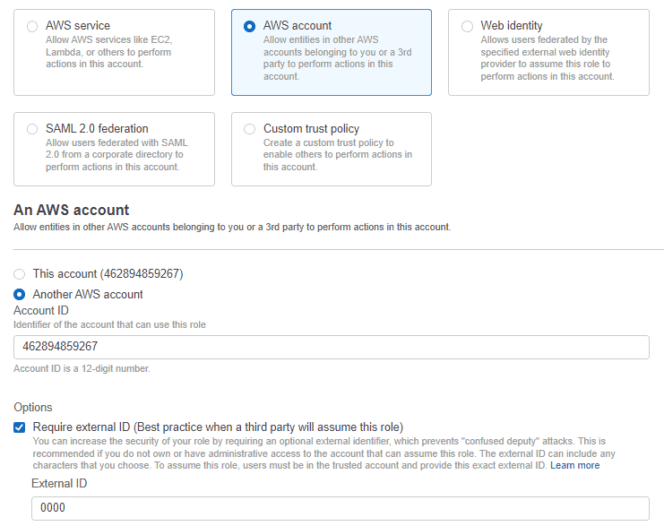
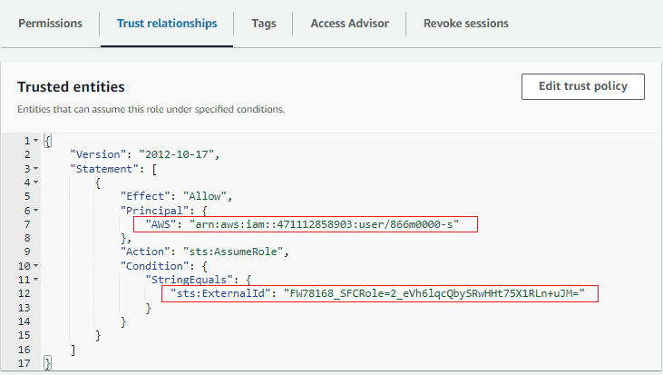
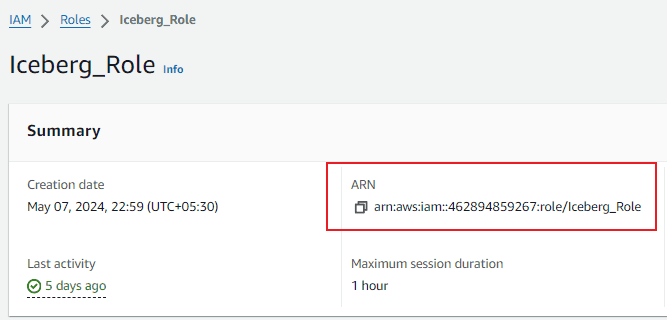
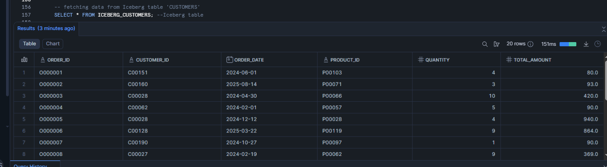
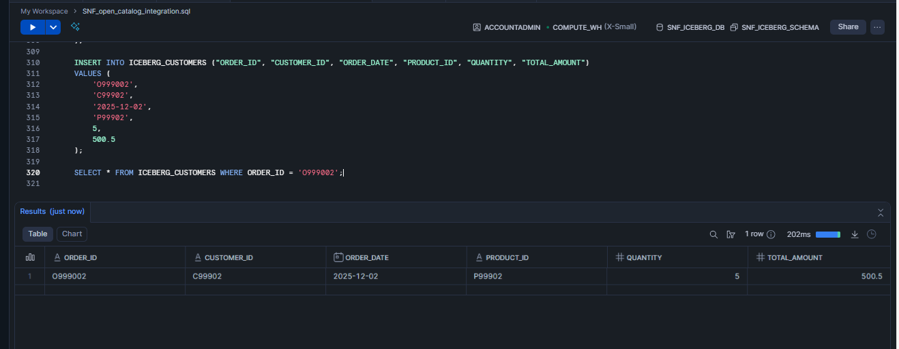
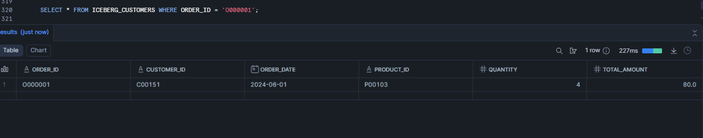
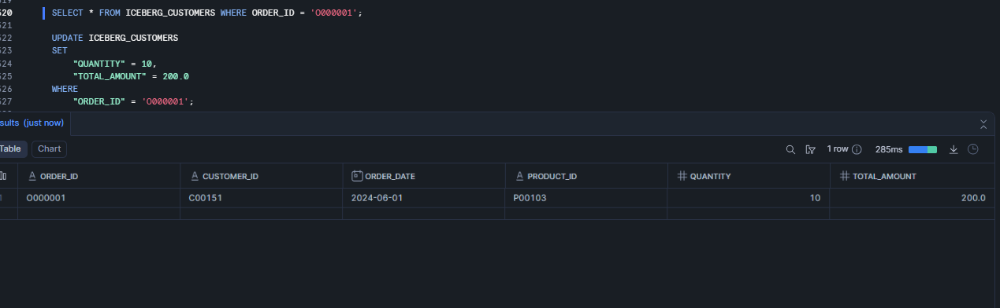
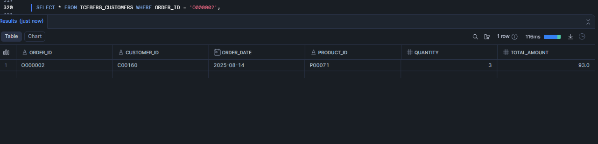
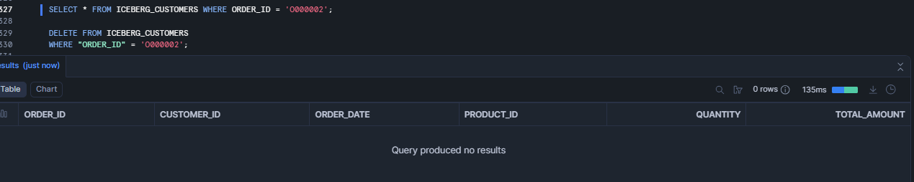

# **Implementation Guide: Snowflake Iceberg Tables and External Volumes on AWS**

# **Executive Summary**

This document outlines the step-by-step procedure for configuring Snowflake Iceberg tables using an AWS S3 bucket as the storage backend. It covers the necessary AWS IAM configurations, Snowflake Storage Integrations, External Volume creation, and the execution of DDL and DML operations to manage Iceberg data.

## **1. AWS Configuration Prerequisites**

To support Snowflake Iceberg tables, the S3 bucket must be located in the same region that hosts the Snowflake account.

### **Step 1: Create IAM Policy**

This policy gives Snowflake the minimum S3 permissions it needs: listing the bucket, discovering its region, and reading/writing/deleting objects in a specific bucket path. These scoped permissions follow least-privilege principles, so Snowflake cannot access other buckets or prefixes beyond what you explicitly allow.

Configure an access policy to allow Snowflake to interact with the specific S3 bucket (your\_bucket\_name).

1. Log into the AWS Management Console and navigate to IAM > Policies > Create policy.
2. Select the JSON tab and enter the following policy content:

```
JSON
{
"Version": "2012-10-17",
"Statement": [
{
"Effect": "Allow",
"Action": [
"s3:ListBucket",
"s3:GetBucketLocation"
],
"Resource": "arn:aws:s3:::your_bucket_name"
},
{
"Effect": "Allow",
"Action": [
"s3:GetObject",
"s3:PutObject",
"s3:DeleteObject"
],
"Resource": "arn:aws:s3::: your_bucket_name /*"
}
]
}
```

3. Name the policy (e.g., snowflake_Iceberg_Policy) and create it.

### **Step 2: Create IAM Role and Trust Relationship**

The IAM role is the security identity that Snowflake assumes when accessing your S3 bucket, instead of using long‑lived access keys. The trust relationship ensures that only the specific Snowflake IAM principal with the correct external ID can assume this role, preventing other AWS accounts from misusing it.

Create an IAM role that Snowflake will assume to access the data.

1. Navigate to IAM > Roles > Create role.
2. Select Trusted entity type as AWS account.
3. Select Another AWS account and specify your AWS account ID temporarily.
4. Select the Require external ID option and enter a placeholder ID (e.g., 0000 or external_icerberg).



5. After creating the role (iceberg_role), update the Trust Relationship with the specific Snowflake IAM user and External ID.



**Trust Relationship JSON:**

```
JSON
{
"Version": "2012-10-17",
"Statement": [
{
"Effect": "Allow",
"Principal": {
"AWS": "arn:aws:iam::719084987142:user/2f9a1000-s"
},
"Action": "sts:AssumeRole",
"Condition": {
"StringEquals": {
"sts:ExternalId": "WQ81422_SFCRole=6_yA5e+WIE7KTwpxpe36Rj6/cFnyo="
}
}
}
]
}

```



## **2. Snowflake Storage Configuration**

Create an external volume that points to the S3 bucket and prefix where Iceberg table data and metadata will be stored. In the external volume definition, reference the IAM role ARN and external ID so Snowflake can access S3 securely without embedding AWS keys in SQL.

**Step 1: Create External Volume**

The External Volume defines the storage location for Iceberg tables.

CREATE OR REPLACE EXTERNAL VOLUME iceberg_snf\_demo\_ext\_vol
STORAGE\_LOCATIONS =
(
(
NAME = 'snf_ext_volume_s3'
STORAGE_PROVIDER = 'S3'
STORAGE_BASE_URL = 's3:// your_bucket_name/your_folder_name1/'
STORAGE_AWS_ROLE_ARN = 'arn:aws:iam::729442710163:role/iceberg_role'
STORAGE_AWS_EXTERNAL_ID = 'WQ81422_SFCRole=6_yA5e+WIE7KTwpxpe36Rj6/cFnyo='
)
)
ALLOW\_WRITES = TRUE;

**Verification:**

Describe the external volume to ensure the storage locations, role ARN, and write permissions are correctly configured. Successful verification confirms that Snowflake can use this volume as the storage backend for Iceberg tables.

DESC EXTERNAL VOLUME iceberg\_snf\_demo\_ext\_vol;

## **3.Staging and Raw Data Ingestion**

This phase involves creating a connection to raw CSV files in S3 to populate the Iceberg table.

**Step 1: File Format and Stage Creation**

Define the CSV format and the external stage pointing to the raw data location.

```
CREATE OR REPLACE FILE FORMAT my_csv_format
TYPE = 'CSV'
FIELD_OPTIONALLY_ENCLOSED_BY = '"'
FIELD_DELIMITER = ','
SKIP_HEADER = 1;

CREATE OR REPLACE STAGE my_iceberg_stage
URL = 's3:// your_bucket_name/your_folder_name1/'
STORAGE_INTEGRATION = my_s3_integration
FILE_FORMAT = my_csv_format;

```

**Verfication**

```
SQL
LIST @my_iceberg_stage;
```

**Step 2: Create External Table (Source Data)**

Create a standard External Table to read the CSV data before loading it into Iceberg.

```
CREATE OR REPLACE EXTERNAL TABLE orders_external (
OrderID           INTEGER AS (VALUE:c1::INTEGER),
CustomerID        INTEGER AS (VALUE:c2::INTEGER),
OrderDate         DATE    AS (VALUE:c3::DATE),
ShipDate          DATE    AS (VALUE:c4::DATE),
DeliveryDate      DATE    AS (VALUE:c5::DATE),
OrderStatus       STRING  AS (VALUE:c6::STRING),
PaymentMethod     STRING  AS (VALUE:c7::STRING),
ShippingMethod    STRING  AS (VALUE:c8::STRING),
ItemCount         INTEGER AS (VALUE:c9::INTEGER),
TotalAmount       FLOAT   AS (VALUE:c10::FLOAT),
Discount          FLOAT   AS (VALUE:c11::FLOAT),
TaxAmount         FLOAT   AS (VALUE:c12::FLOAT),
ShippingCost      FLOAT   AS (VALUE:c13::FLOAT),
Currency          STRING  AS (VALUE:c14::STRING),
Warehouse         STRING  AS (VALUE:c15::STRING),
SalesRep          STRING  AS (VALUE:c16::STRING),
PromoCode         STRING  AS (VALUE:c17::STRING),
IsGift            BOOLEAN AS (VALUE:c18::BOOLEAN),
GiftMessage       STRING  AS (VALUE:c19::STRING),
ReturnEligible    BOOLEAN AS (VALUE:c20::BOOLEAN)
)
WITH LOCATION = @my_iceberg_stage
FILE_FORMAT = (TYPE = 'CSV' FIELD_DELIMITER = ',' SKIP_HEADER = 1);

```

**Verify Data**

```
SELECT * FROM orders_external  LIMIT 10;
```

## **4. Iceberg Table Implementation**

**Step 1: Create Iceberg Table**

Initialize the Iceberg table using the previously created External Volume ('ICEBERG\_SNF\_DEMO\_EXT\_VOL') and define the catalog as SNOWFLAKE.

```
CREATE OR REPLACE ICEBERG TABLE ICERBERG_CUSTOMERS (
"ORDER_ID" TEXT,
"CUSTOMER\ID" TEXT,
"ORDER_DATE" DATE,
"PRODUCT_ID" TEXT,
"QUANTITY" NUMBER(2, 0),
"TOTAL_AMOUNT" NUMBER(6, 1)
)
EXTERNAL_VOLUME = 'ICEBERG_SNF_DEMO_EXT_VOL'
CATALOG = 'SNOWFLAKE';
```

**Step 2: Load Data**

```
INSERT INTO ICEBERG_CUSTOMERS ("ORDER\_ID", "CUSTOMER\_ID", "ORDER\_DATE", "PRODUCT\_ID", "QUANTITY", "TOTAL\_AMOUNT")
VALUES
('O000001', 'C00151', '2024-06-01', 'P00103', 4, 80.0),
('O000002', 'C00160', '2025-08-14', 'P00071', 3, 93.0),
('O000003', 'C00028', '2024-04-30', 'P00066', 10, 420.0),
('O000004', 'C00062', '2024-02-01', 'P00057', 5, 90.0),
('O000005', 'C00028', '2024-12-12', 'P00028', 4, 940.0),
('O000006', 'C00128', '2025-03-22', 'P00119', 9, 864.0),
('O000007', 'C00190', '2024-10-27', 'P00097', 1, 90.0),
('O000008', 'C00027', '2024-02-19', 'P00062', 9, 369.0),
('O000009', 'C00003', '2024-08-09', 'P00103', 6, 120.0),
('O000010', 'C00155', '2025-03-28', 'P00009', 5, 4165.0),
('O000011', 'C00051', '2024-10-30', 'P00106', 8, 56.0),
('O000012', 'C00160', '2025-03-20', 'P00096', 8, 424.0),
('O000013', 'C00180', '2024-08-23', 'P00113', 1, 70.0),
('O000014', 'C00052', '2024-10-18', 'P00012', 7, 6608.0),
('O000015', 'C00131', '2024-02-22', 'P00113', 5, 350.0),
('O000016', 'C00184', '2025-11-06', 'P00081', 1, 350.0),
('O000017', 'C00130', '2025-03-28', 'P00092', 6, 306.0),
('O000018', 'C00129', '2025-09-16', 'P00019', 2, 1606.0),
('O000019', 'C00172', '2024-09-18', 'P00090', 6, 1812.0),
('O000020', 'C00068', '2025-07-08', 'P00055', 8, 1080.0);
```

**Verify Iceberg Data:**

SELECT \* FROM ICEBERG\_CUSTOMERS;



**5. DML Operations and Testing**

The following SQL commands validate the Iceberg table's ability to handle transactional operations (INSERT, UPDATE, DELETE).

**Insert Records**

```
INSERT INTO CUSTOMERS ("ORDER_ID", "CUSTOMER_ID", "ORDER_DATE", "PRODUCT_ID", "QUANTITY", "TOTAL_AMOUNT")
VALUES (
'O999001',
'C99901',
'2025-12-01',
'P99901',
2,
150.0
);

INSERT INTO CUSTOMERS ("ORDER_ID", "CUSTOMER_ID", "ORDER_DATE", "PRODUCT_ID", "QUANTITY", "TOTAL_AMOUNT")
VALUES (
'O999002',
'C99902',
'2025-12-02',
'P99902',
5,
500.5
);
```



**Update Records**

```
UPDATE CUSTOMERS
SET
"QUANTITY" = 10,
"TOTAL_AMOUNT" = 200.0
WHERE
"ORDER_ID" = 'O000001';
```

**Before updating**



**After updating**



**Delete Records**

```
DELETE FROM CUSTOMERS
WHERE "ORDER_ID" = 'O000002';
```

**Before deleting**



**After deleting**


