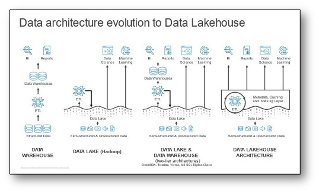

**Apache Iceberg Tables**

Apache Iceberg is an open-source table format that brings ACID transactions, time travel, schema evolution, and partition evolution to data lakes. This comprehensive guide covers Iceberg architecture, hands-on implementation across cloud platforms (AWS S3, Azure Data Lake Storage, Google Cloud Storage), and integration with Snowflake external volumes for enterprise data governance.

# **Introduction to Apache Iceberg**

# **What is Apache Iceberg?**

Apache Iceberg is a table format designed to overcome the limitations of using raw Parquet or ORC files directly in a data lake, while still storing data in familiar formats such as Parquet, Avro, and ORC. It provides:

* **ACID Transactions**: Guarantees data consistency across concurrent readers and writers
* **Time Travel**: Query data at any point in time for auditing and recovery
* **Schema and Partition Evolution**: Modify table structures without breaking existing queries
* **Hidden Partitioning**: Automatic partition pruning without exposing partition columns to users
* **Open Format**: Language and engine-agnostic (Spark, Flink, Trino, Presto, Snowflake)

# **Why Iceberg Matters**

Traditional data lakes suffer from:

* Slow queries due to large file listings
* Data consistency issues with concurrent writes
* Difficulty evolving schemas without downtime
* Partition management complexity

Iceberg solves these through a metadata-driven approach.

**Evolution of Modern Data Architectures**

Apache Iceberg plays a central role in enabling the data Lakehouse by bringing warehouse‑grade features such as ACID transactions, time travel, and schema evolution directly to cloud data lakes. By standardizing table metadata and access across engines, Iceberg turns raw object storage into a governed, analytics‑ready layer that supports BI, data science, and machine learning on the same data.

# **Apache Iceberg Architecture**

This diagram illustrates Snowflake Iceberg Tables as a central, feature-rich data layer offering capabilities like ACID transactions, time travel, and schema evolution. It highlights the tables' seamless interoperability, connecting Snowflake's ingestion and transformation tools with external storage and analytics services across AWS, Azure, and GCP cloud platforms.

# **Three-Layer Architecture**

Apache Iceberg uses a metadata-first design with three core layers:

#### **Layer 1: Catalog**

The catalog is the single source of truth for table metadata. It manages:

* **Namespace Management**: Organization of tables into databases
* **Table References**: Pointers to the latest metadata file location
* **Catalog Implementations**:

#### **Layer 2: Metadata Layer**

**Apache Iceberg is neither a storage engine nor an execution engine.**

The below diagram illustrates the Apache Iceberg table format architecture, presenting both logical and physical views of data management. The flow initiates at the Iceberg Catalog, which maintains a pointer to the current metadata JSON file. Subsequent metadata files define snapshots and reference manifest lists, which in turn track specific manifest files. This hierarchical metadata structure ultimately locates the individual parquet data files stored in the data layer. The numbered steps highlight the precise path Iceberg uses to resolve the current state of a table down to its specific files.

Metadata files track table state without modifying data files. Key components:

#### **Layer 3: Data Layer**

The data layer stores actual table data:

* **Data Files**: Parquet, ORC, or Avro format
* **Location**: S3 buckets (AWS), ADLS (Azure), GCS (Google Cloud), HDFS
* **Immutability**: Data files are write-once (new files for updates/deletes)
* **File Organization**: Automatic partitioning managed by Iceberg

# **Travel and Snapshots**

Iceberg maintains complete table history through immutable snapshots, enabling point-in-time queries and recovery.

# **Schema and Partition Evolution**

* **Schema Evolution**: Add, remove, rename, or reorder columns without rewriting data
* **Partition Evolution**: Change partitioning scheme without full table reorganization
* **Type Promotion**: Safely promote integer to long, float to double

# **Iceberg Integration and Ecosystem**

# **Integration** **with Data Processing Engines**

Iceberg's engine-agnostic design enables seamless integration with multiple data processing frameworks:

# **Iceberg on Cloud Platforms**

This diagram compares AWS S3, Azure ADLS, and Google GCS as cloud storage options for Apache Iceberg metadata, summarizing their key capabilities. It helps readers choose a platform by highlighting strengths like versioning, IAM/RBAC, lifecycle policies, diagnostics, and audit logging.
